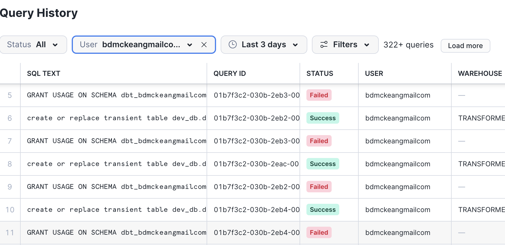
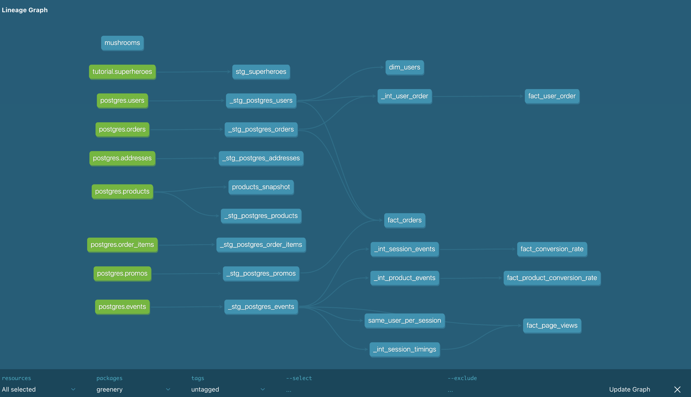

## Part 1 conversion questions

```
select * from fact_conversion_rate;
```


| Total Sessions | Sessions with Purchase | Conversion Ratio |
| -------- | ------- | ------- |
| 578 | 361 | 0.625 |


```
select * from fact_product_conversion_rate;
```
| Product ID | Total Sessions | Sessions with Purchase | Purchase Ratio |
| -------- | ------- |  -------- | ------- |
| 05df0866-1a66-41d8-9ed7-e2bbcddd6a3d | 60 | 0 | 0 |
| 35550082-a52d-4301-8f06-05b30f6f3616 | 45 | 0 | 0 |
| 37e0062f-bd15-4c3e-b272-558a86d90598 | 62 | 0 | 0 |
| 4cda01b9-62e2-46c5-830f-b7f262a58fb1 | 61 | 0 | 0 |
| 55c6a062-5f4a-4a8b-a8e5-05ea5e6715a3 | 62 | 0 | 0 |
| 579f4cd0-1f45-49d2-af55-9ab2b72c3b35 | 54 | 0 | 0 |
| 58b575f2-2192-4a53-9d21-df9a0c14fc25 | 61 | 0 | 0 |
| 5b50b820-1d0a-4231-9422-75e7f6b0cecf | 59 | 0 | 0 |
| 5ceddd13-cf00-481f-9285-8340ab95d06d | 67 | 0 | 0 |
| 615695d3-8ffd-4850-bcf7-944cf6d3685b | 65 | 0 | 0 |
| 64d39754-03e4-4fa0-b1ea-5f4293315f67 | 59 | 0 | 0 |
| 689fb64e-a4a2-45c5-b9f2-480c2155624d | 67 | 0 | 0 |
| 6f3a3072-a24d-4d11-9cef-25b0b5f8a4af | 51 | 0 | 0 |
| 74aeb414-e3dd-4e8a-beef-0fa45225214d | 63 | 0 | 0 |
| 80eda933-749d-4fc6-91d5-613d29eb126f | 74 | 0 | 0 |
| 843b6553-dc6a-4fc4-bceb-02cd39af0168 | 68 | 0 | 0 |
| a88a23ef-679c-4743-b151-dc7722040d8c | 46 | 0 | 0 |
| b66a7143-c18a-43bb-b5dc-06bb5d1d3160 | 63 | 0 | 0 |
| b86ae24b-6f59-47e8-8adc-b17d88cbd367 | 53 | 0 | 0 |
| bb19d194-e1bd-4358-819e-cd1f1b401c0c | 78 | 0 | 0 |
| be49171b-9f72-4fc9-bf7a-9a52e259836b | 49 | 0 | 0 |
| c17e63f7-0d28-4a95-8248-b01ea354840e | 55 | 0 | 0 |
| c7050c3b-a898-424d-8d98-ab0aaad7bef4 | 75 | 0 | 0 |
| d3e228db-8ca5-42ad-bb0a-2148e876cc59 | 56 | 0 | 0 |
| e18f33a6-b89a-4fbc-82ad-ccba5bb261cc | 70 | 0 | 0 |
| e2e78dfc-f25c-4fec-a002-8e280d61a2f2 | 63 | 0 | 0 |
| e5ee99b6-519f-4218-8b41-62f48f59f700 | 66 | 0 | 0 |
| e706ab70-b396-4d30-a6b2-a1ccf3625b52 | 56 | 0 | 0 |
| e8b6528e-a830-4d03-a027-473b411c7f02 | 73 | 0 | 0 |
| fb0e8be7-5ac4-4a76-a1fa-2cc4bf0b2d80 | 64 | 0 | 0 |

## Part 2
Used some macros -- see macro dir


## Part 3
### Showing role being granted



## Part 4
Intalled dbt-util

used macro in fact_conversion_rate.sql


## Part 5 dbt docs


from dbt docs
```
{{
  config(
    materialized='view'
  )
}}


with sessions as
(
    select * 
    from {{ ref('_stg_postgres_events') }}
)


SELECT 
    session_id
    , min(created_at_utc) as session_start
    , max(created_at_utc) as session_end
    , {{ has_item('event_type', 'page_view') }}
    , {{ has_item('event_type','add_to_cart') }} 
    , {{ has_item('event_type','product_shipped') }}
    , {{ has_item('event_type','checkout') }}
FROM sessions
GROUP BY session_id
order by session_id
```

## Part 6 snapshot

```

 WITH changes AS (
    SELECT 
        COALESCE(old.product_id, new.product_id) as product_id,
        old.name as old_name,
        new.name as new_name,
        old.price as old_price,
        new.price as new_price,
        old.inventory as old_inventory,
        new.inventory as new_inventory
    FROM products_snapshot old
    FULL OUTER JOIN products_snapshot new
        ON old.product_id = new.product_id
        AND old.dbt_valid_to IS NOT NULL  -- old version
        AND new.dbt_valid_to IS NULL      -- current version
    WHERE old.dbt_valid_to IS NOT NULL    -- only show items that have changed
)

SELECT 
    product_id,
    old_name,
    new_name,
    old_price,
    new_price,
    old_inventory,
    new_inventory
FROM changes
WHERE old_inventory != new_inventory  -- only show rows with actual changes
ORDER BY product_id;
```

| Product ID | Old Name | New Name | Old Price | New Price | Old Inventory | New Inventory |
| -------- | ------- | -------- | ------- | -------- | ------- | -------- | 
| 4cda01b9-62e2-46c5-830f-b7f262a58fb1 | Pothos | Pothos | 30.50 | 30.50 | 40 | 20 |
| 55c6a062-5f4a-4a8b-a8e5-05ea5e6715a3 | Philodendron | Philodendron | 45.00 | 45.00 | 51 | 25 |
| be49171b-9f72-4fc9-bf7a-9a52e259836b | Monstera | Monstera | 50.75 | 50.75 | 77 | 64 |
| fb0e8be7-5ac4-4a76-a1fa-2cc4bf0b2d80 | String of pearls | String of pearls | 80.50 | 80.50 | 58 | 10 |


