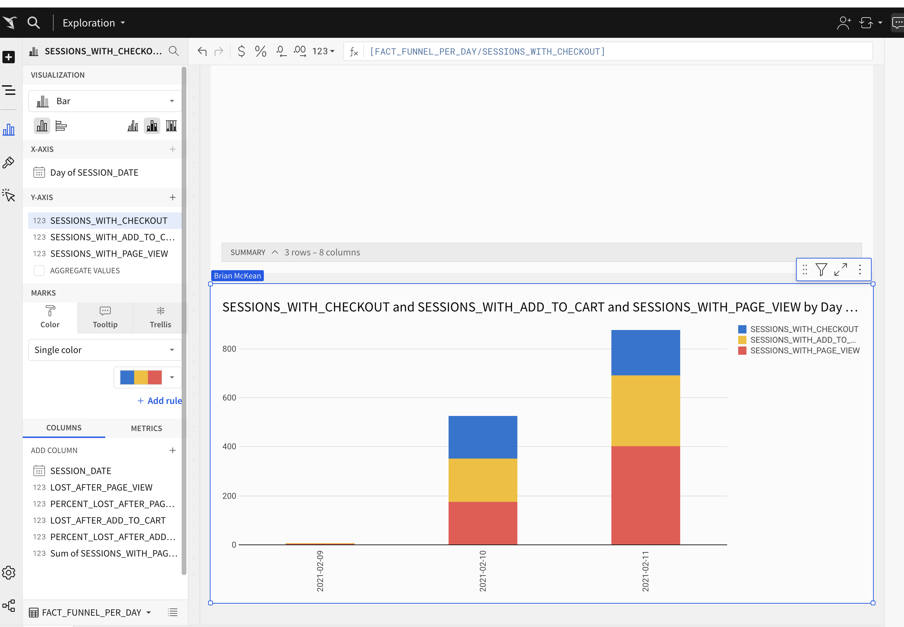

# Part 1. dbt Snapshots

Let's update our products snapshot one last time to see how our data is changing:

1) Run the products snapshot model using dbt snapshot and query it in snowflake to see how the data has changed since last week. 

2) Which products had their inventory change from week 3 to week 4? 
```
select 
*
from
dbt_bdmckeangmailcom.products_snapshot
where dbt_updated_at >= '2024-11-01'
order by product_id asc,
dbt_updated_at asc;
```

| PRODUCT_ID | NAME | PRICE | INVENTORY | DBT_SCD_ID | DBT_UPDATED_AT | DBT_VALID_FROM | DBT_VALID_TO |
| ---------- |------- | ------ | ------ | ---------- |  ------------- | -------------- |  ----------- |
| 55c6a062-5f4a-4a8b-a8e5-05ea5e6715a3 | Philodendron | 45 | 30 | cd35331e81e0d95ab2af26cada8e1ef7 | 2024-11-01 | 19:05:32.197 | 2024-11-01 | 19:05:32.197 |
| 689fb64e-a4a2-45c5-b9f2-480c2155624d | Bamboo | 15.25 | 23 | dbdeff8c8553249776d8ac216dab214e | 2024-11-01 | 19:05:32.197 | 2024-11-01 | 19:05:32.197 |
| b66a7143-c18a-43bb-b5dc-06bb5d1d3160 | ZZ | Plant | 25 | 41 | 0921e006d97420990ee4f61a31081be5 | 2024-11-01 | 19:05:32.197 | 2024-11-01 | 19:05:32.197 |
| be49171b-9f72-4fc9-bf7a-9a52e259836b | Monstera | 50.75 | 31 | ba62835e47fec77463eae95fed1b30ac | 2024-11-01 | 19:05:32.197 | 2024-11-01 | 19:05:32.197 |


3) Now that we have 3 weeks of snapshot data, can you use the inventory changes to determine which products had the most fluctuations in inventory? Did we have any items go out of stock in the last 3 weeks? 
Note: I missed on of the snapshot weeks so my answers may be different.  

* 3a Which products had the most fluctuations in inventory?`
```
select
    name
    , count(*) as change_count
    from 
    dbt_bdmckeangmailcom.products_snapshot
    group by name
    having change_count > 1
    order by change_count desc;
```
| NAME | CHANGE_COUNT |
| ----- | ----------- |
| Philodendron | 3 |
| Monstera | 3 |
| Pothos | 2 |
| String of pearls | 2 |
| Bamboo | 2 |
| ZZ Plant | 2 |

* 3b
Did we have any items go out of stock in the last 3 weeks?
```
select * from
dbt_bdmckeangmailcom._stg_postgres_products
where inventory = 0;
```

| PRODUCT_ID | NAME | PRICE | INVENTORY |
| ---------- | -----  | ----- | -------- |
| 4cda01b9-62e2-46c5-830f-b7f262a58fb1 | Pothos | 30.5 | 0 |
| fb0e8be7-5ac4-4a76-a1fa-2cc4bf0b2d80 | String of pearls | 80.5 | 0 |


* How are our users moving through the product funnel?
```
select *
from 
dbt_bdmckeangmailcom.fact_funnel;
```

| SESSIONS_WITH_PAGE_VIEW | SESSIONS_WITH_ADD_TO_CART | SESSIONS_WITH_CHECKOUT | LOST_AFTER_PAGE_VIEW | PERCENT_LOST_AFTER_PAGE_VIEW | LOST_AFTER_ADD_TO_CART | PERCENT_LOST_AFTER_ADD_TO_CART |
| --- | --- |--- | ---  | -------- | --- | ----- |
| 578 | 467 | 361 | 111 | 0.192042 | 106 | 0.226981 |


* Which steps in the funnel have largest drop off points?
We see from above that we lose most from add to cart to checkout


### Sigma dashboard



